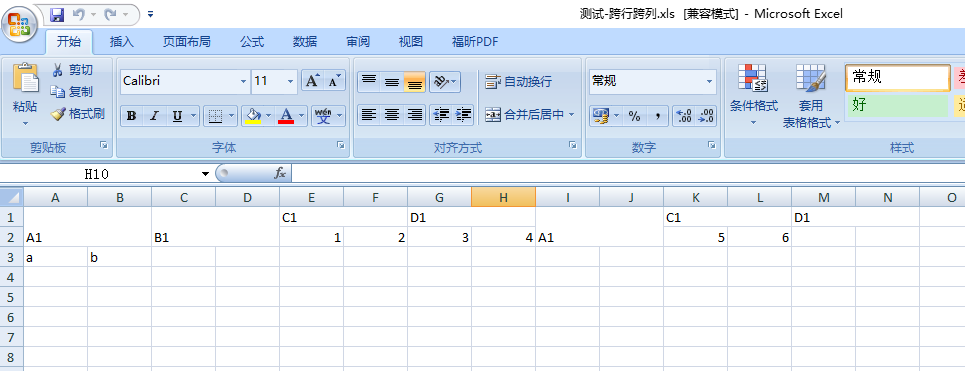
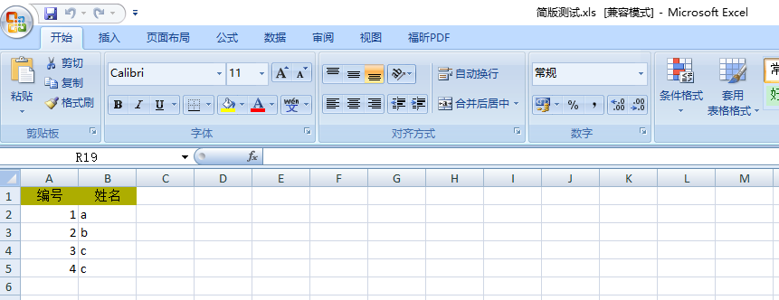

# PHPExcel-Helper

#### 项目介绍
# PHPExcel-Helper是什么？
PHPExcel辅助开发类，帮助开发者快速创建各类excel。

#### 安装教程

使用 composer 安装，依赖 phpexcel
~~~
$ composer require whalephp/phpexcel-helper
~~~

#### Demo

demo 1：简单表格
~~~
<?php 
include './vendor/autoload.php';

$ToolExcel = new \whalephp\tool\PHPExcelHelper();
$list = array(
		array('id'=>1,'name'=>'a'),
		array('id'=>2,'name'=>'b'),
		array('id'=>3,'name'=>'c'),
		array('id'=>4,'name'=>'c'),
);
$key = array(
		'id'	=> '编号',
		'name'	=> '姓名',
);
$ToolExcel->exportExcelSimp('简版测试',$key,$list);
~~~

demo 2：跨行跨列表格
~~~
<?php 
include './vendor/autoload.php';

$ToolExcel = new \whalephp\tool\PHPExcelHelper();
$data = array(
		'file_name'	=> '测试-跨行跨列',
		'sheetInfo'	=> array(
				'sheetIndex'	=> 0,
				'sheetTitle'	=> '订单汇总',
		),
		'startCell'	=> array(					//开始写入位置
				'row'=>1,
				'col'=>1
		),
		'cellData'	=> array(
				array(
						array(
								'val'		=> 'A1',
								'rowspan'	=> 2,		//跨行数
								'colspan'	=> 2,		//跨列数
								'remarks'	=> '备注1',
						),
						array(
								'val'		=> 'B1',	//
								'rowspan'	=> 2,		//跨行数
								'colspan'	=> 2,		//跨行数
						),
						array(
								'val'		=> 'C1',
								'colspan'	=> 2,
						),
						array(
								'val'		=> 'D1',	//
								'colspan'	=> 2,
						),
						array(
								'val'		=> 'A1',
								'rowspan'	=> 2,		//跨行数
								'colspan'	=> 2,		//跨列数
								'remarks'	=> '备注1',
						),
						array(
								'val'		=> 'C1',
								'colspan'	=> 2,
						),
						array(
								'val'		=> 'D1',	//
								'colspan'	=> 2,
						),
				),
				array(
						array(
								'val'		=> '1',
						),
						array(
								'val'		=> '2',
						),
						array(
								'val'		=> '3',
						),
						array(
								'val'		=> '4',
						),
						array(
								'val'		=> '5',
						),
						array(
								'val'		=> '6',
						),
				),
				array(
						array(
								'val'		=> 'a',
						),
						array(
								'val'		=> 'b',	//
						),
				),

		),
);

$ToolExcel->exportExcel($data);
~~~

